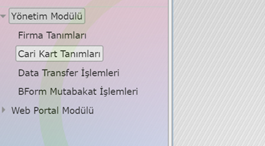
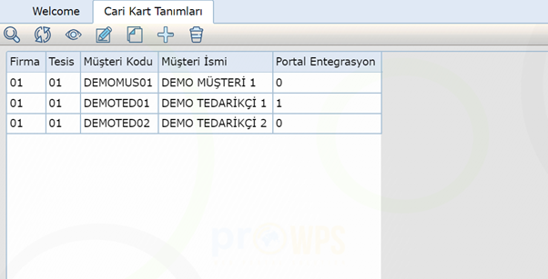
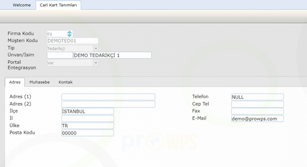
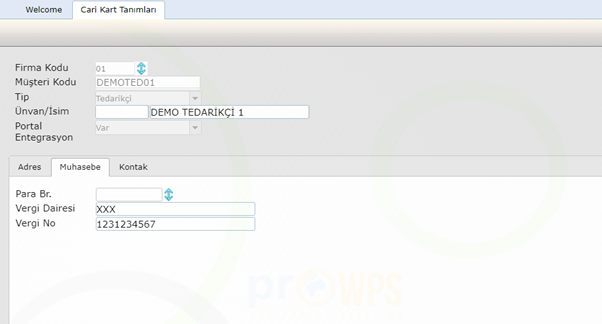

Cari Kart Tanımlama
===================
Programda yer alan Cari Kartlar menü adımı ile ilgili uygulamaya erişilebilir.

   
Cari Kartlar uygulamasında müşteri/tedarikçi tanımlarını ve ilgili kayıtların portal entegrasyon işlemlerini yapabilmekteyiz. Bu uygulama altındaki kayıtlar manuel oluşturulabileceği gibi, data transfer uygulaması ile de sisteme yüklenebilmektedir.

Uygulama çalıştırıldığında kullanıcıyı alttaki ekran görüntüsü karşılayacaktır. Ekranın üzerinde yer alan butonlar vasıtası ile arama, filtreleme, kaydın içeriğini görüntüleme, kayıtta değişik yapma, yeni kayıt oluşturma gibi işlemler yapılabilmektedir.

   
Herhangi bir kayıt seçilip kaydı göster ya da değiştir denildiğinde ise alttaki detay ekrana ulaşılacaktır. Bu ekran/lar vasıtası ile kayda ait detay bilgiler görüntülenip, düzenlenebilecektir.

   

