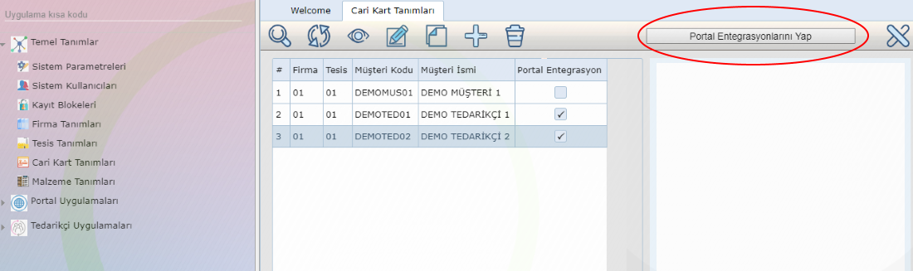

Cari Kart Portal Entegrasyonu
=============================

Cari Kartlar uygulaması üzerinde yer alan bu entegrasyon fonksiyonu ile seçilen tedarikçi(lerin) portal hesapları oluşturularak, tedarikçilere hesap bilgilerinin gönderimi sağlanır. 

Liste üzerinde tedarikçi(ler) seçildikten sonra "entegrasyon" butonuna basılır. Sistem sırasıyla seçilen her tedarikçi için hesap bilgilerini üretir ( kullanıcı adı/ şifre ) ve cari kart içinde tanımlı olan mail adresine üretilen bu hesap bilgilerini iletir. Her iletim sonrası oluşan hatalar ekranın sağ tarafında yer alan durum mesajı alanından izlenebilir ayrıca portal entegrasyonu başarı ile yapılan cari kartlar liste üzerinde işarelenir.
