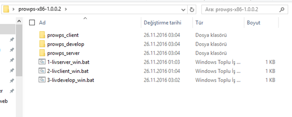

İlk Açılış
==========
Programı sitemiz download linki vasıtasıyla indirdikten sonra gelen "zip" paketi bilgisayarımızda uygun bir konuma açıyoruz. Oluşturduğumuz bu yeni klasörü açtığımızda karşımıza şekilde gibi bir dizin yapısı çıkıyor.

Dizin içeriğini incelediğimizde gördüklerimiz:

  * Sunucu program klasörü "prowps_server"
  * İstemci program klasörü "prowps_client"
  * Geliştirme programı klasörü "prowps_develop"
  * Sunucu program başlatan dosya "1-livserver_win.bat" / "1-livserver_oth.sh"
  * İstemci program başlatan dosya "2-livclient_win.bat" / "2-livclient_oth.sh"
  * Geliştirme programı başlatan dosya "3-livdevelop_win.bat" / "3-livdevelop_oth.sh"

Programı başlatmak için sırasıyla (dosya ismi başındaki sıra nosu) başlatıcı uygulamaları çalıştırıyoruz. Uygulama geliştirme yapmayacaksanız 3-livdevelop başlatıcısını çalıştırmanız gerekli değildir, ilk 2 başlatıcının çalışması yeterli olacaktır.

Başlatıcılar çalıştıktan sonra uygulamaya bağlanmak için sisteminizde yüklü olan browser' ı başlatmalısınız. Tarayıcınızın adres çubuğunu "http://localhost:20000/login.aspx" yazarak uygulama giriş adımına ulaşabilirsiniz. İlk giriş için kullanıcı adı / şifre admin olarak belirlenmiştir.
