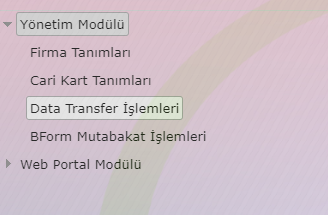
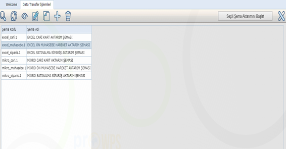
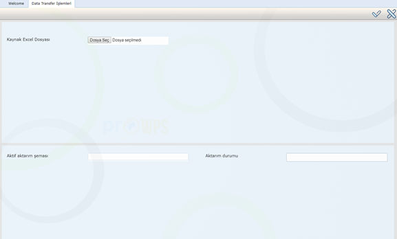

Data Transfer İşlemleri
=======================

Programda yer alan Data Transfer İşlemleri menü adımı ile ilgili uygulamaya erişilir.

   
Data transfer işlemleri adımı ile ProWPS’ in harici sistemlerle olan veri alış verişini yönetebilmekteyiz. Uygulama ile sisteme direk bağlantı yada Excel seçenekleri ile veri alınabilmektedir. Ayrıca yine aynı uygulamayı yeni bir aktarım altyapısı hazırlamaktada kullanabilmekteyiz. Bu başlık altında hazır şemaların kullanımı ve yeni şema oluşturma konulu iki başlık bulunmaktadır.

  1. Hazır Şemalarla Aktarım Yapılması
  
  Aktaracağımız veriye ilişkin şema ister direk bağlantı isterse de Excel aktarımı yapısında olsun her iki yöntemde de uygulama şekli aynı olacaktır. Listeden aktarım yapılacak şema satırı yada satırları seçili hale getirildikten sonra ekrandaki “Seçili Şema Aktarımı Başlat” butonu ile aktarım ekranına ulaşılır.

   

   
Gelen aktarım ekranında kaynak belge “dosya seç” butonu vasıtası ile seçildikten sonra ekranın sağ üst köşesindeki “OK” butonu ile aktarım işlemi başlatılır. Aktarım esnasında ekranın alt tarafında bulunan “Aktarım durumu” kontrolöründe aktarım işleminin %? değerini görebileceksiniz. İşlem tamamlanması ardından sistem yeniden ana ekrana dönecektir. 
