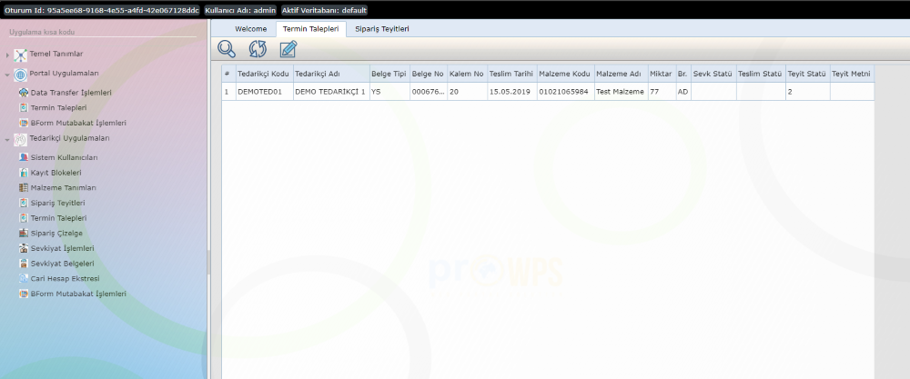
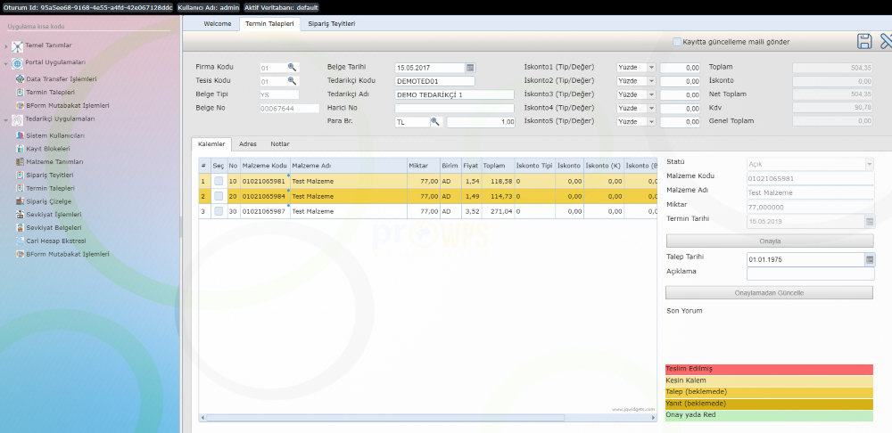

Termin Talepleri
=================

Termin talepleri uygulaması çift taraflı kullanılan bir uygulamadır. Müşteri (Sağlayıcı) tarafında tedarikçilerden gelen termin taleplerini listelemek ve cevaplamak, Tedarikçi tarafında ise benzer şekilde Müşteri (Sağlayıcı) tarafından gelen yanıtları cevaplandırmak maksatlı kullanılır.

Uygulamaya Tedarikçi tarafında Tedarikçi Uygulamaları > Termin Talepleri menü adımı ile Müşteri (Sağlayıcı) tarafında ise Portal Uygulamaları > Termin Talepleri menu adımı ile erişilebilir.

.. image:: img/deadline_request_1.png
   :align: center

Uygulama ilgili menu adımı ile başlatıldığında ilk açılışta cevap beklenen termin talepleri listelenecektir.

   
Listenen istenilen termin talebi seçilebilir yada arama kriterleri özelleştirilerek liste güncellenebilir. Listeden kayıt seçilip düzenle butonuna basıldığında, termin talebinde bulunulan kaleminde içinde yer aldığı sipariş detayları açılacaktır.

   
Belge detayında kalem statüleri farklı renklerle ifade edilmektedir. Yanıt beklenen statüdeki kalem seçilip üzerinde cevaplama yada onaylama işlemleri yapılabilir. Talepte bulunulan termin sadece ** onaylama ** işlemi ile kapatılabilir, cevap ve yanıt modunda ilgili talep Müşteri (Sağlayıcı) ve Tedarikçi arasında onaylanana dek gidip gelecektir.
