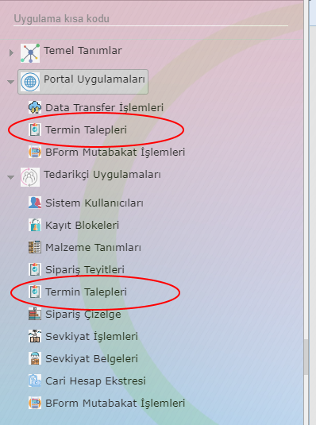

Termin Talepleri
=================

Termin talepleri uygulaması çift taraflı kullanılan bir uygulamadır. Müşteri (Sağlayıcı) tarafında tedarikçilerden gelen termin taleplerini listelemek ve cevaplamak, Tedarikçi tarafında ise benzer şekilde Müşteri (Sağlayıcı) tarafından gelen yanıtları cevaplandırmak maksatlı kullanılır.

Uygulamaya Tedarikçi tarafında Tedarikçi Uygulamaları > Termin Talepleri menü adımı ile Müşteri (Sağlayıcı) tarafında ise Portal Uygulamaları > Termin Talepleri menu adımı ile erişilebilir.

