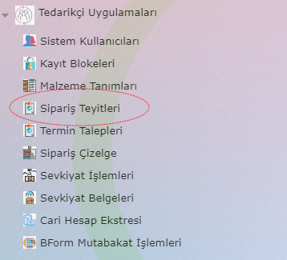
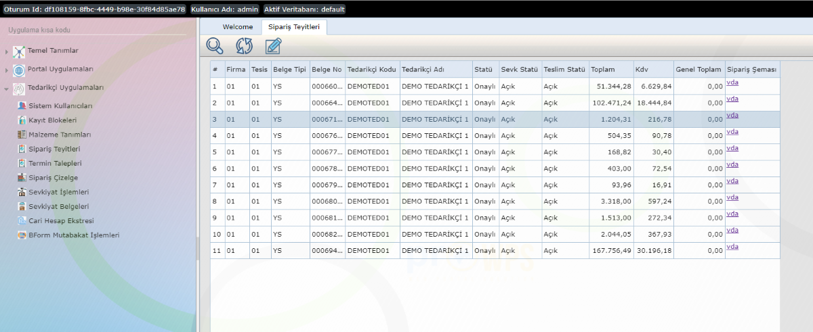
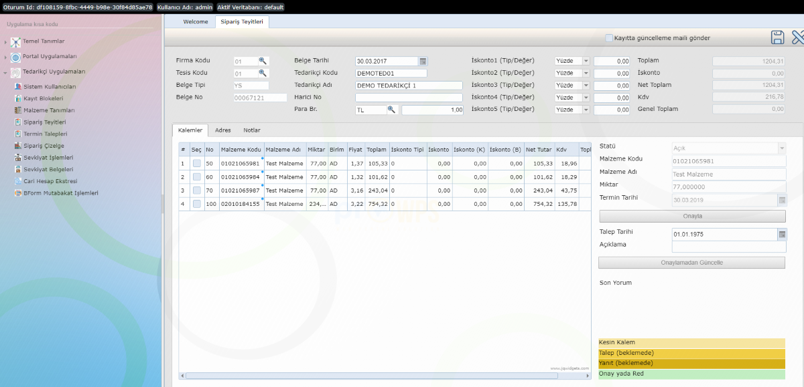

Sipariş Teyitleri
=================

Programda yer alan Tedarikçi Uygulamaları > Sipariş Teyitleri menü adımı ile ilgili uygulamaya erişilebilir.

   
Bu uygulama ile Müşteriden (Sağlayıcıdan) gelen siparişler görülebilir, istenirse siparişlerin çeşitli formatlarda (sağlayıcı tarafından belirlenen uluslararası edi formatlarında) içeriği alınabilir ve sipariş kalemlerine ilişkin teyit yazışmaları yapılabilir.

   
Uygulama çalıştırıldığında açılış ekranında Müşteride (Sağlayıcıda) bekleyen açık siparişler listelenecek, istenirse araç çubuğunda bulunan büyüteç vasıtasıyla arama işlevi çeşitli kriterler dahilinde özelleştirebilmektedir. Açılışta yada arama sonucu filtrelenen liste üzerinde bulunan Sipariş Şeması kolonunda yer alan linkler vasıtasıyla seçilen siparişlerin istenen formatta dışa aktarımı sağlanabilir.

Listeden bir sipariş satırı seçilip kalem butonu yardımı ile sipariş içeriği görüntülenebilir.

Açılan detay ekranda üstte siparişe ait genel bilgiler, sol altta sipariş kalemleri ve sağ altta ise sipariş kalemlerine ait teyit bilgileri görülebilmektedir. Sipariş kalemleri teyit durumlarına göre renklendirilmektedir. İlk bakışta kalem renklerinde teyit talebinde bulunduğunuz kalemlere ilişkin yanıtlanmamış, yanıtlanmış yada onaylanmış durumları görebilirsiniz. 

