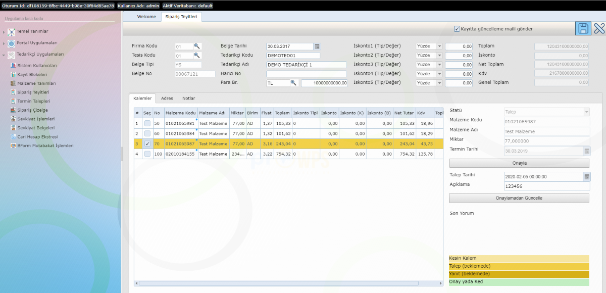

Sipariş Teyitleri
=================

Programda yer alan Tedarikçi Uygulamaları > Sipariş Teyitleri menü adımı ile ilgili uygulamaya erişilebilir.

.. image:: img/order_confirm_1.png
   :align: center
   
Bu uygulama ile Müşteriden (Sağlayıcıdan) gelen siparişler görüntülenebilir, istenirse siparişlerin çeşitli formatlarda (Sağlayıcı tarafından belirlenen uluslararası edi formatlarında) içeriği alınabilir ve sipariş kalemlerine ilişkin teyit yazışmaları yapılabilir.

.. image:: img/order_confirm_2.png
   :align: center
   
Uygulama çalıştırıldığında açılış ekranında Müşteride (Sağlayıcıda) bekleyen açık siparişler listelenecek, istenirse araç çubuğunda bulunan büyüteç vasıtasıyla arama işlevi çeşitli kriterler dahilinde özelleştirilebilinecektir. Açılışta yada arama sonucu filtrelenen liste üzerinde bulunan "Sipariş Şeması" kolonunda yer alan linkler vasıtasıyla seçilen siparişlerin istenen formatta dışa aktarımı sağlanabilinecektir.

Listeden bir sipariş satırı seçilip kalem butonu yardımı ile sipariş içeriği görüntülenebilir.

.. image:: img/order_confirm_3.png
   :align: center

Açılan detay ekranda üstte siparişe ait genel bilgiler, sol altta sipariş kalemleri ve sağ altta ise sipariş kalemlerine ait teyit bilgileri görülmektedir. Uygulama üzerinde sipariş kalemleri teyit durumlarına göre renklendirilmektedir. İlk bakışta kalem renklerinde teyit talebinde bulunduğunuz kalemlere ilişkin yanıtlanmamış, yanıtlanmış yada onaylanmış durumları görebilirsiniz. 

*** Beyaz renkte yada kesin renkte olan kalemler talep girmediğiniz müddetçe tarafınızca kabul edilmiş sayılmaktadır.

Kalemler listesinden açık statüde yada cevabınız beklenen kalemi seçip , sol taraf teyit durumlarını görüntüleyebilirsiniz. Teyit durumunda yeni bir talep girişi için istediğiniz yeni termini ve açıklamınızı girdikten sonra "Onaylamadan Güncelle" butonuna basarsanız teyit talebiniz Müşteriye (Sağlayıcıya) bildirilir ve Müşteri dönüşüne göre aksiyonlarınızı alabilirsiniz. Termin grubunda yer alan "Onayla" butonu ilede Müşteri terminini onaylayabilirsiniz.

Son olarak yaptığınız termin taleplerini ve onaylarınızı sağ üst köşede bulunan disket butonuyla kaydetmelisiniz. Kaydetme öncesi "Kayıtta mail gönder" tikini atmanız halinde ise kayıt esnasında girdiğiniz termin taleplerine ilişkin Müşteriye (Sağlayıcıya) mail gönderim aksiyonunu tetikleyebilirsiniz.

