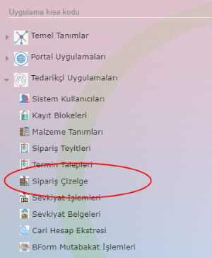
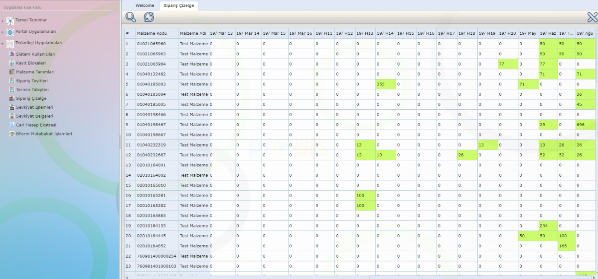

Sipariş Çizelge
=================

Programda yer alan Tedarikçi Uygulamaları > Sipariş Çizelge menü adımı ile ilgili uygulamaya erişilebilir.

   
Uygulama açık siparişlerinizi Müşteri (Sağlayıcı)' nin belirlediği periyotlarda sizlere çizelgeleyecektir. Uygulamanın varsayılan ayarları önümüzdeki ilk 21 güne düşen siparişleri günlük, takip eden 60 günü haftalık ve takip eden diğer açık siparişleri ise aylık periyotlarda listeyelecek şekilde kurgulanmıştır. Çizelge günün tarihinden çizilmeye başlar, ilgili günün öncesine düşen ve henüz karşılamadığınız siparişlerinizi ise "Bakiye" kolonunda sizlere gösterir.

Uygulamanın varsayılan çizelge ayarları Müşteri (Sağlayıcı) isteği doğrultusunda değiştirilebilir.

