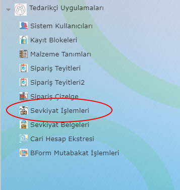

Sevkiyat İşlemleri
===================

Programda yer alan Tedarikçi Uygulamaları > Sevkiyat İşlemleri menü adımı ile ilgili uygulamaya erişilebilir.

   
Uygulama başlatıldığında ekranın ortadan ikiye bölündüğünü göreceksiniz. Ekranın üst bölümü açık siparişlerinizi listeyelecek ve sevkiyata konu olan kalemleri seçmenizi sağlayacak , ekranın alt bölümü ile ilgili sevk belgesi için üzerinde çalıştığınız kalemleri gösterecek. İki bölme arasında ve ekranın en altında kalan fonksiyonel butonlar vasıtası ilede işlemlerimizi yapıyor olacağız.

Bu uygulama üzerinden gerçekleşen veya planlanan sevkiyat bilgilerini sisteme dahil edebilirsiniz. İşlem yapabilmek için irsaliye yada sevk numarası girişi gerekmektedir. Eğer planlanan bir sevkiyat düzenliyorsanız buraya önceden ayırdığınız irsaliye numarasını girebilirsiniz.

İşlem adımları:

1. Açık kalemler listesinden sevkiyata konu olan kalemlerin seçimi
2. Kutu ve palet barkodlarının düzenlenmesi
3. İrsaliye numrası girilerek sevk belgelerinin sisteme kaydı
**4. Asn çekimi (diğer bir konu başlığında) anlatılacak**
